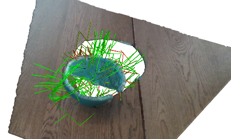
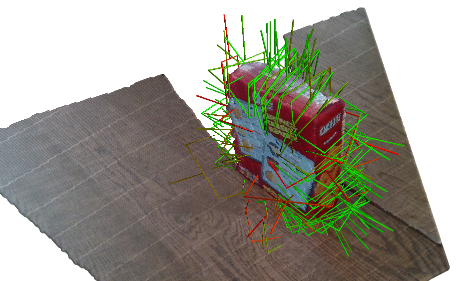

# 6-DoF GraspNet: Variational Grasp Generation for Object Manipulation
Implementation of [6-DoF GraspNet](https://arxiv.org/abs/1905.10520) with tensorflow and python. This repo has been tested with python 2.7 and tensorflow 1.12.

# License
The source code is released under [MIT License](LICENSE) and the trained weights are released under [CC-BY-NC-SA 2.0](TRAINED_MODEL_LICENSE).

## Installation
This code has been tested with tenorflow 1.12, CUDA 10.0, and CUDNN 7.1.2 on Ubuntu 16.04.

1) Tensorflow installation: In case you want to install tensorflow 1.12 you can use the command bellow:
```shell
wget https://storage.googleapis.com/tf-performance/tf_binary/tensorflow-1.12.0.a6d8ffa.AVX2.CUDA10-cp27-cp27mu-linux_x86_64.whl
pip install tensorflow-1.12.0.a6d8ffa.AVX2.CUDA10-cp27-cp27mu-linux_x86_64.whl
rm tensorflow-1.12.0.a6d8ffa.AVX2.CUDA10-cp27-cp27mu-linux_x86_64.whl
```
2) Clone this repository: `git lfs clone https://github.com/NvLabs/6dof-graspnet`. Note the `lfs` in the command to make sure that the pre-trained models are cloned properly.

3) Clone pointnet++: `git clone https://github.com/charlesq34/pointnet2`.

4) `cd 6dof-graspnet`

5) Run `pip install -r requirements.txt` to install necessary python libraries.

6) [optional] For multi-gpu training only: Install horovod and MPI from [here](https://github.com/horovod/horovod). We used single-gpu training for training VAE and 8-gpu training for the evaluator network.

7) Build the tf_ops using `sh compile_pointnet_tfops.sh`.

8) Download the checkpoints to the `checkpoints` folder. Trained checkpoints are released under [CC-BY-NC-SA 2.0](TRAINED_MODEL_LICENSE) and can be downloaded from [here](https://drive.google.com/drive/folders/1mVX2kqXg9BZ22y3HEyqta20tiQrL8OK_?usp=sharing). **The checkpoints of the models trained on [ACRONYM Dataset](https://sites.google.com/nvidia.com/graspdataset) are uploaded.**


## Demo
Run the demo using the command below. In the paper, we only used gradient-based refinement. We also experimented with Metropolis-Hastings sampling and found it giving better results in shorter time.
As a result, we keep Metropolis-Hastings sampling as the default for the demo.

We added a gan formulation which improves the sampling quality. See details in the [paper](https://arxiv.org/abs/1905.10520). Command for running the demo:
```shell
python -m demo.main # metropolis hasting sampling refinement. Optimal default setting for comparison with other methods.
python -m demo.main --gradient_based_refinement # uses gradient based refinement
```

Using VAE as sampler:
```shell
python -m demo.main --vae_checkpoint_folder checkpoints/npoints_1024_train_evaluator_0_allowed_categories__ngpus_1_/
```

 
## Dataset

### Get ShapeNet Models
Download the meshes with ids written in [shapenet_ids.txt](shapenet_ids.txt) from https://www.shapenet.org/. Some of the objects are in `ShapenetCore` and `ShapenetSem`.

### Prepare ShapeNet Models
1. Clone and build: https://github.com/hjwdzh/Manifold
2. Create a watertight mesh version assuming the object path is model.obj: `manifold model.obj temp.watertight.obj -s`
3. Simplify it: `simplify -i temp.watertight.obj -o model.obj -m -r 0.02`

### Download the dataset:
The dataset can be downloaded from [here](https://drive.google.com/open?id=1GkFrkvpP-R1letnv6rt_WLSX80o43Jjm). The dataset has 3 folders:
1) `grasps` folder: contains all the grasps for each object.
2) `meshes` folder: has the folder for all the meshes used. Except `cylinder` and `box` the rest of the folders are empty and need to be populated by the downloaded meshes from shapenet.
3) `splits` folder: contains the train/test split for each of the categories.

Verify the dataset by running `python grasp_data_reader.py` to visualize the evaluator data and `python grasp_data_reader.py --vae-mode` to visualize only the positive grasps.

## Training
Training for conditional variational auto-encoder (CVAE) and evaluator are done separately:

GAN Training Example Command:
```shell
python train.py \
  --train_evaluator 0 \
  --dataset_root_folder $DATASET_ROOT_FOLDER \
  --logdir $VAE_TRAINING_FOLDER \
  --gan 1
```
use `--gan 0` to train CVAE.

Evaluator Training Example Command (single gpu):
```shell
python train.py \
  --train_evaluator 1 \
  --dataset_root_folder $DATRASET_ROOT_FOLDER \
  --logdir $EVALUATOR_TRAINING_FOLDER \
  --ngpus 1 
```

Train multi-gpu using horovod and mpirun (using 8 gpus) as in the paper:
```shell
mpirun --allow-run-as-root -np 8 --npernode 8 -x NCCL_DEBUG=INFO python train.py \
  --train_evaluator 1 \
  --dataset_root_folder $DATRASET_ROOT_FOLDER \
  --logdir $EVALUATOR_TRAINING_FOLDER \
  --ngpus 8
```

Note that training CVAE is done with 1 gpu and evaluator is trained with 8 GPUs.

## Quantitative Evaluation
Two types of evaluations are supported:
1) Success-coverage plot is activated by `--eval_vae_and_evaluator=1`.
2) Precision-Recall for just the evaluator is activated by `--eval_grasp_evaluator=1`.

Example command for running evaluation:
```shell
python eval.py \
  --vae_training_folder $VAE_TRAINING_FOLDER \
  --evaluator_training_folder $EVALUATOR_TRAINING_FOLDER \ 
  --eval_data_folder $EVAL_DATA_FOLDER \
  --generate_data_if_missing 1 \
  --dataset_root_folder $DATASET_FOLDER \
  --num_experiments 100 \
  --output_folder $OUTPUT_FOLDER \
  --eval_vae_and_evaluator 1
```

We will release the evaluations of the grasps using [NVIDIA FleX](https://developer.nvidia.com/flex) in the future. In order to use `eval.py`, the [eval_grasps_on_flex](eval.py#L452) method needs to be implemented.

## Citation
If you find our work useful in your research, please consider citing:
```
inproceedings{mousavian2019graspnet,
  title={6-DOF GraspNet: Variational Grasp Generation for Object Manipulation},
  author={Arsalan Mousavian and Clemens Eppner and Dieter Fox},
  booktitle={International Conference on Computer Vision (ICCV)},
  year={2019}
}
```
